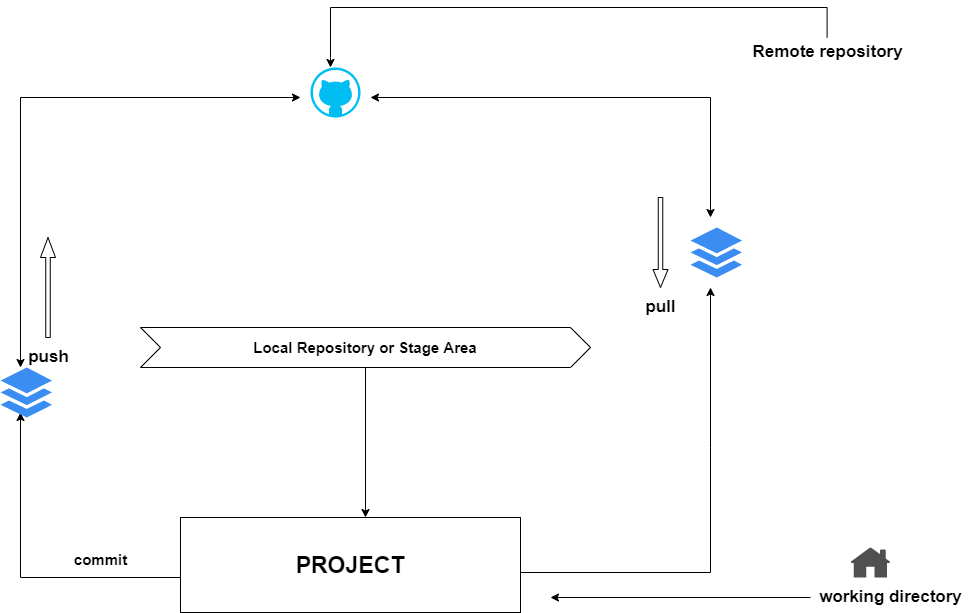
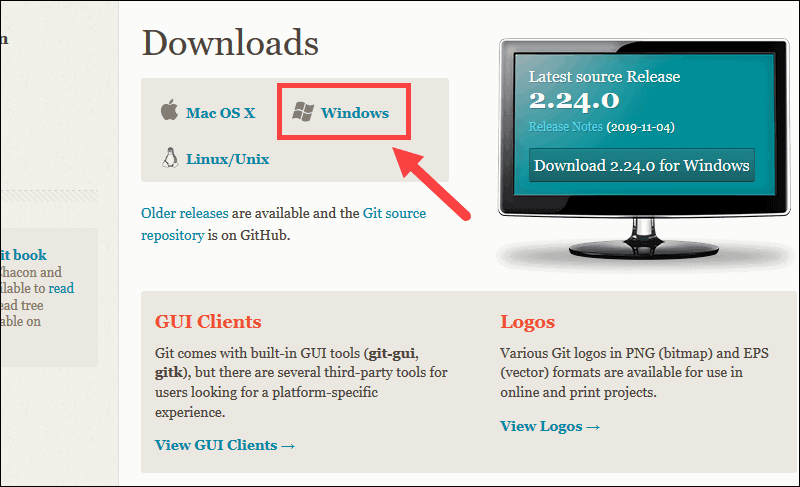
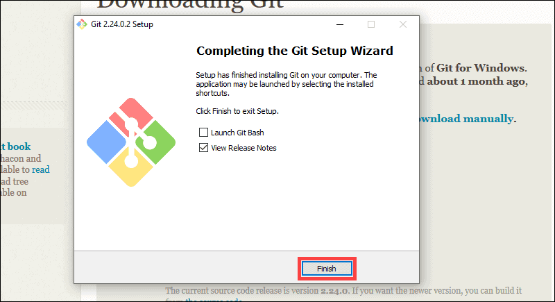

# Company Name: TSR Learning
## About
TSRLearning is a global online learning platform that offers anyone, anywhere access to online courses.

## Content
- Version Control: Git

## Overview
Git is an Open Source Distributed Version Control System.

### Git Architecture or work-flow
Here is the layout for operating git.

## Get Started
To get started with Git, you need to install the software

### Installations
1. Download the Git Software
- Click on => Git Download[https://git-scm.com/download/win]
    - see image below:
    

2. Run the exe file after download
   - example is shown in the image below
   

# Reference
  - [Email US](mailto:info@tsrlearning.io)
  - [TSR Learning](https://www.tsrlearning.io)

Hurray :rocket: :rocket: you installed Git :smile: :smile:

# Documentation Reference
- Download [https://git-scm.com/download/win]
- Git Docs [https://git-scm.com/docs]
